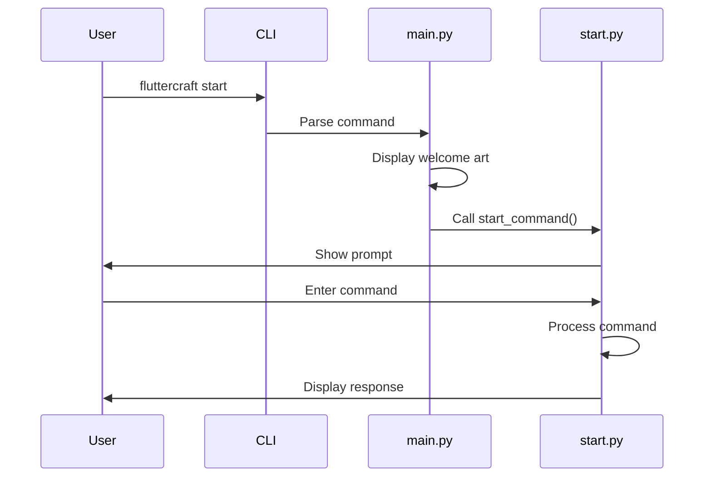

# FlutterCraft — Architecture Guide

This document outlines the current architecture of the FlutterCraft CLI tool.

---

## 🏗️ Current Architecture

### Core Components

```
fluttercraft/
├── main.py              # CLI entrypoint and Typer app configuration
├── commands/            # Command implementations
│   ├── __init__.py      # Package initialization
│   └── start.py         # Start command implementation
├── config/              # Configuration handling (future)
│   └── __init__.py      # Package initialization
└── utils/               # Utility functions (future)
    └── __init__.py      # Package initialization
```

### Entry Point

The main entry point is `fluttercraft/main.py`, which:
1. Sets up the Typer CLI app
2. Defines the welcome ASCII art display function
3. Registers the `start` command
4. Provides a callback for global CLI options

### Commands

Currently, only the `start` command is implemented:

- **start.py**: Implements the interactive CLI with:
  - Command prompt using Rich
  - Help command display
  - Placeholder responses for unimplemented commands
  - Exit command handling

### Installation

The package is installed via `setup.py`, which:
1. Configures dependencies (typer, pyfiglet, colorama, rich)
2. Sets up the console script entry point
3. Defines package metadata

---

## 🔄 Command Flow



---

## 🧩 Component Details

### 1. CLI Processing

The command line processing is handled by Typer, which provides:
- Command registration
- Help text generation
- Command parsing and dispatch
- Option handling

### 2. Start Command

The start command implements a simple Read-Evaluate-Print Loop (REPL) that:
1. Displays a prompt using Rich
2. Reads user input
3. Processes commands (help, exit, etc.)
4. Displays appropriate responses

### 3. ASCII Art Display

The welcome display uses:
- pyfiglet for ASCII art generation
- Rich for colored text and panels
- Informative welcome messages

---

## 🔮 Future Architecture

As development continues, the following components will be added:

1. **Utility Modules**: For file I/O, shell execution, and validation
2. **Configuration System**: For managing user preferences
3. **Create Command**: For Flutter project generation
4. **Environment Management**: Flutter and FVM installation
5. **Integration Features**: Backend and GitHub integration

---

This document will be updated as new components are implemented.
