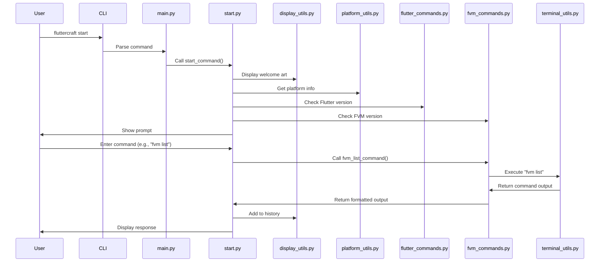

# FlutterCraft — Architecture Guide

This document outlines the current architecture of the FlutterCraft CLI tool.

---

## 🏗️ Current Architecture

### Core Components

```
fluttercraft/
├── main.py                      # Typer entrypoint wiring CLI to start command
├── __main__.py                  # Direct module execution entry point
├── commands/
│   ├── __init__.py
│   ├── bootstrap.py             # Builds command registry + executor
│   ├── core/                    # Shared command infrastructure
│   │   ├── base.py              # Abstract command base class
│   │   ├── executor.py          # CommandExecutor orchestrating dispatch
│   │   ├── models.py            # Command metadata, context, result dataclasses
│   │   └── registry.py          # CommandRegistry with alias/category support
│   ├── start.py                 # Interactive REPL entrypoint
│   ├── slash_commands.py        # `/quit`, `/clear`, `/help`, etc.
│   ├── fvm_command.py           # Aggregated FVM command family
│   └── flutter_command.py       # Flutter command family (upgrade, etc.)
└── utils/
    ├── __init__.py
    ├── themed_display.py        # Facade delegating to theme display service
    ├── beautiful_prompt.py      # Prompt session + completion plumbing
    ├── platform_utils.py        # Platform detection utilities
    ├── terminal_utils.py        # Terminal execution helpers
    └── themes/
        ├── service.py           # ThemeDisplayService central renderer
        ├── theme_manager.py     # Theme persistence + lookup
        └── professional_themes.py
```

### Entry Point

The main entry point is `fluttercraft/main.py`, which:
1. Sets up the Typer CLI app
2. Defines the welcome ASCII art display function
3. Registers the `start` command
4. Provides a callback for global CLI options

### Commands

The command layer is now driven by a registry/executor pair:

- **core/** modules define the contract every command follows. Each command returns a `CommandResult` to standardize success, messaging, and flow control (`should_continue`).
- **bootstrap.py** registers built-in command families and produces a `CommandExecutor` consumed by `start.py`.
- **slash_commands.py** implements `/quit`, `/clear`, `/help`, `/about`, and `/theme` as discrete command classes.
- **fvm_command.py** and **flutter_command.py** wrap existing orchestration logic while emitting consistent results and refreshing display state.
- **start.py** now focuses on the REPL: building context, delegating to the executor, and printing command results.

### Utility Modules

- **display_utils.py**: UI and display utilities:
  - Welcome art display
  - Screen refreshing
  - Command history tracking
  - Clear command implementation

- **terminal_utils.py**: Terminal interaction utilities:
  - Command execution with loading indicators
  - Output capture for command results

- **system_utils.py**: System interaction utilities:
  - Dependency checking
  - Chocolatey detection for Windows

- **platform_utils.py**: Platform detection utilities:
  - OS detection
  - Shell detection
  - Python version detection

### Installation

The package is installed via `setup.py`, which:
1. Configures dependencies (typer, pyfiglet, colorama, rich)
2. Sets up the console script entry point
3. Defines package metadata

---

## 🔄 Command Flow



---

## 🧩 Component Details

### 1. CLI Processing

Typer still provides the outer CLI surface (`fluttercraft start`). Once the REPL begins, command parsing is handled by the new registry/executor stack:
- **CommandRegistry** resolves commands by name or alias and organises them by category.
- **CommandExecutor** normalizes tokens, routes to the appropriate command, and safeguards against runtime errors.
- **CommandContext** shares platform/Flutter/FVM state, Rich console, and prompt history across commands.

### 2. Start Command

`start.py` constructs the command system via `build_command_system()` and wires prompt completions with live metadata from the registry. The REPL loop now:
1. Displays environment information using the theme service
2. Prompts with `beautiful_prompt.py`
3. Dispatches user input through `CommandExecutor`
4. Prints `CommandResult` messages and respects `should_continue`
5. Keeps context (platform/Flutter/FVM dictionaries) in sync for subsequent commands

### 3. FVM Commands

The FVM command implementations:
1. Detect FVM installation
2. Install/uninstall FVM on different platforms
3. List available Flutter versions with channel filtering
4. Display installed Flutter versions with enhanced formatting
5. Handle errors and provide fallbacks

### 4. Help System

The help system provides:
1. Global help with available commands
2. Command group help (e.g., FVM commands)
3. Command-specific help with usage examples
4. Support for multiple help command formats

### 5. Display & Theming

Display responsibilities now flow through `ThemeDisplayService` located in `utils/themes/service.py`:
1. Renders ASCII art with a dedicated FlutterCraft gradient
2. Produces welcome/about/help sections using theme semantic colors
3. Exposes `print_success`/`print_error` helpers via `themed_display.py`
4. Centralizes screen clearing and Rich console interactions

### 6. Terminal Utilities

The terminal utilities provide:
1. Command execution with loading indicators
2. Output capture for command results
3. Error handling for command execution

---

## 🔮 Future Architecture

As development continues, the following components will be added:

1. **FVM Enhanced Management**: Version removal and setup
2. **Flutter Management**: Detection and installation
3. **Create Command**: For Flutter project generation
4. **Configuration System**: For managing user preferences
5. **Integration Features**: Backend and GitHub integration

---

This document will be updated as new components are implemented.
