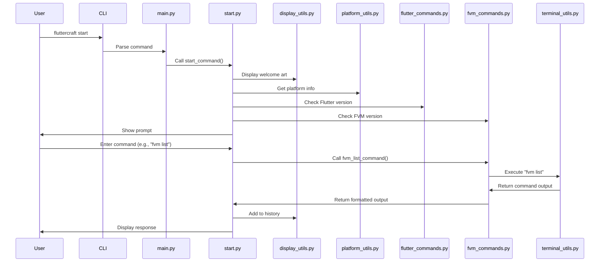

# FlutterCraft — Architecture Guide

This document outlines the current architecture of the FlutterCraft CLI tool.

---

## 🏗️ Current Architecture

### Core Components

```
fluttercraft/
├── main.py                  # CLI entrypoint and Typer app configuration
├── __main__.py              # Direct module execution entry point
├── __init__.py              # Package initialization
├── commands/                # Command implementations
│   ├── __init__.py          # Package initialization and exports
│   ├── start.py             # Start command implementation
│   ├── fvm_commands.py      # FVM command implementations
│   ├── flutter_commands.py  # Flutter command implementations
│   └── help_commands.py     # Help system implementations
├── config/                  # Configuration handling (future)
│   └── __init__.py          # Package initialization
└── utils/                   # Utility functions
    ├── __init__.py          # Package initialization
    ├── display_utils.py     # Display and UI utilities
    ├── platform_utils.py    # Platform detection utilities
    ├── system_utils.py      # System interaction utilities
    └── terminal_utils.py    # Terminal and command execution utilities
```

### Entry Point

The main entry point is `fluttercraft/main.py`, which:
1. Sets up the Typer CLI app
2. Defines the welcome ASCII art display function
3. Registers the `start` command
4. Provides a callback for global CLI options

### Commands

The following commands are implemented:

- **start.py**: Implements the interactive CLI with:
  - Command prompt using Rich
  - Help command handling
  - FVM command handling
  - Clear command handling
  - Exit command handling
  - Environment information display

- **fvm_commands.py**: Implements FVM-related commands:
  - `check_fvm_version()`: Detects FVM installation
  - `fvm_install_command()`: Installs FVM on different platforms
  - `fvm_uninstall_command()`: Uninstalls FVM with cleanup options
  - `fvm_releases_command()`: Lists available Flutter versions
  - `fvm_list_command()`: Displays installed Flutter versions

- **help_commands.py**: Implements the help system:
  - Global help display
  - FVM-specific help displays
  - Command-specific help for each command
  - Help command handling

### Utility Modules

- **display_utils.py**: UI and display utilities:
  - Welcome art display
  - Screen refreshing
  - Command history tracking
  - Clear command implementation

- **terminal_utils.py**: Terminal interaction utilities:
  - Command execution with loading indicators
  - Output capture for command results

- **system_utils.py**: System interaction utilities:
  - Dependency checking
  - Chocolatey detection for Windows

- **platform_utils.py**: Platform detection utilities:
  - OS detection
  - Shell detection
  - Python version detection

### Installation

The package is installed via `setup.py`, which:
1. Configures dependencies (typer, pyfiglet, colorama, rich)
2. Sets up the console script entry point
3. Defines package metadata

---

## 🔄 Command Flow



---

## 🧩 Component Details

### 1. CLI Processing

The command line processing is handled by Typer, which provides:
- Command registration
- Help text generation
- Command parsing and dispatch
- Option handling

### 2. Start Command

The start command implements a Read-Evaluate-Print Loop (REPL) that:
1. Displays environment information
2. Shows a prompt using Rich
3. Reads user input
4. Processes commands (help, fvm, clear, exit, etc.)
5. Dispatches to appropriate command handlers
6. Displays formatted responses
7. Tracks command history

### 3. FVM Commands

The FVM command implementations:
1. Detect FVM installation
2. Install/uninstall FVM on different platforms
3. List available Flutter versions with channel filtering
4. Display installed Flutter versions with enhanced formatting
5. Handle errors and provide fallbacks

### 4. Help System

The help system provides:
1. Global help with available commands
2. Command group help (e.g., FVM commands)
3. Command-specific help with usage examples
4. Support for multiple help command formats

### 5. Display Utilities

The display utilities provide:
1. Welcome ASCII art generation
2. Rich formatting for tables and text
3. Command history tracking
4. Screen refreshing

### 6. Terminal Utilities

The terminal utilities provide:
1. Command execution with loading indicators
2. Output capture for command results
3. Error handling for command execution

---

## 🔮 Future Architecture

As development continues, the following components will be added:

1. **FVM Enhanced Management**: Version removal and setup
2. **Flutter Management**: Detection and installation
3. **Create Command**: For Flutter project generation
4. **Configuration System**: For managing user preferences
5. **Integration Features**: Backend and GitHub integration

---

This document will be updated as new components are implemented.
