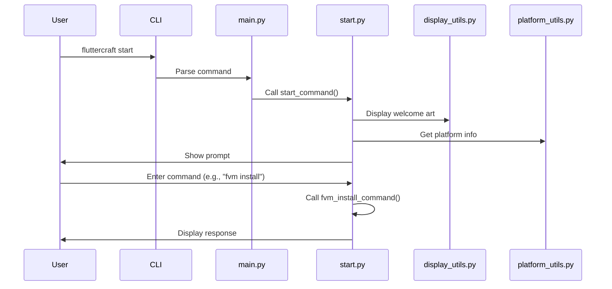

# FlutterCraft — Architecture Guide

This document outlines the current architecture of the FlutterCraft CLI tool.

---

## 🏗️ Current Architecture

### Core Components

```
fluttercraft/
├── main.py                  # CLI entrypoint and Typer app configuration
├── __main__.py              # Direct module execution entry point
├── __init__.py              # Package initialization
├── commands/                # Command implementations
│   ├── __init__.py          # Package initialization and exports
│   └── start.py             # Start command implementation
├── config/                  # Configuration handling (future)
│   └── __init__.py          # Package initialization
└── utils/                   # Utility functions
    ├── __init__.py          # Package initialization
    ├── display_utils.py     # Display and UI utilities
    └── platform_utils.py    # Platform detection utilities
```

### Entry Point

The main entry point is `fluttercraft/main.py`, which:
1. Sets up the Typer CLI app
2. Defines the welcome ASCII art display function
3. Registers the `start` command
4. Provides a callback for global CLI options

### Commands

The following commands are implemented in `fluttercraft/commands/start.py`:

- **start**: Implements the interactive CLI with:
  - Command prompt using Rich
  - Help command handling
  - FVM command handling
  - Clear command handling
  - Exit command handling
  - Environment information display

- **FVM Commands**:
  - `check_fvm_version()`: Detects FVM installation
  - `fvm_install_command()`: Installs FVM on different platforms
  - `fvm_uninstall_command()`: Uninstalls FVM with cleanup options

### Utility Modules

- **display_utils.py**: UI and display utilities:
  - Welcome art display

- **platform_utils.py**: Platform detection utilities:
  - OS detection
  - Shell detection
  - Python version detection

### Installation

The package is installed via `setup.py`, which:
1. Configures dependencies (typer, pyfiglet, colorama, rich)
2. Sets up the console script entry point
3. Defines package metadata

---

## 🔄 Command Flow


```mermaid
sequenceDiagram
    User->>CLI: fluttercraft start
    CLI->>main.py: Parse command
    main.py->>start.py: Call start_command()
    start.py->>display_utils.py: Display welcome art
    start.py->>platform_utils.py: Get platform info
    start.py->>User: Show prompt
    User->>start.py: Enter command (e.g., "fvm install")
    start.py->>start.py: Call fvm_install_command()
    start.py->>User: Display response
```

---

## 🧩 Component Details

### 1. CLI Processing

The command line processing is handled by Typer, which provides:
- Command registration
- Help text generation
- Command parsing and dispatch
- Option handling

### 2. Start Command

The start command implements a Read-Evaluate-Print Loop (REPL) that:
1. Displays environment information
2. Shows a prompt using Rich
3. Reads user input
4. Processes commands (help, fvm, clear, exit, etc.)
5. Dispatches to appropriate command handlers
6. Displays formatted responses
7. Tracks command history

### 3. FVM Commands

The FVM command implementations:
1. Detect FVM installation
2. Install/uninstall FVM on different platforms
3. Handle errors and provide fallbacks

### 4. Display Utilities

The display utilities provide:
1. Welcome ASCII art generation
2. Rich formatting for tables and text

---

## 🔮 Future Architecture

As development continues, the following components will be added:

1. **Enhanced FVM Management**: Listing, removing, and setting up Flutter versions.
2. **Flutter Management**: Detection and installation
3. **Create Command**: For Flutter project generation
4. **Configuration System**: For managing user preferences
5. **Integration Features**: Backend and GitHub integration

---

This document will be updated as new components are implemented.