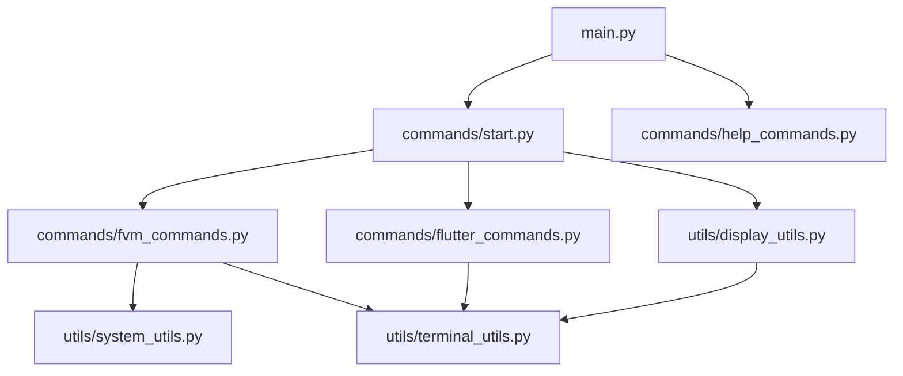

# FlutterCraft — Implementation Roadmap

---

## 🎯 Current Implementation Status

### ✅ Completed Components
- [x] Basic CLI structure with Typer and Rich
- [x] Entry point (main.py)
- [x] `start` command implementation with interactive shell
- [x] Welcome ASCII art display
- [x] Comprehensive documentation structure
- [x] Project setup (setup.py)
- [x] FVM installation and management
- [x] FVM releases listing with channel filtering
- [x] FVM installed versions listing
- [x] Comprehensive help system
- [x] Clear command implementation
- [x] Error handling for FVM commands

### ❌ Components for Future Implementation
- [ ] Flutter detection and installation
- [ ] FVM version removal functionality
- [ ] FVM version setup functionality
- [ ] Project creation wizard
- [ ] Backend integration (Firebase, Supabase)
- [ ] GitHub repo creation
- [ ] App icon generation
- [ ] Test suite
- [ ] Configuration system

---

## 📋 Implementation Timeline

### 🚀 Phase 1: Foundation (Completed)
**Priority: HIGH**

- [x] Create basic directory structure
- [x] Implement initial CLI with welcome art
- [x] Setup interactive command prompt
- [x] Create pip installation process
- [x] Implement basic utility modules
- [x] Add clear command functionality
- [x] Add comprehensive help system

**Effort Estimate**: 10-15 hours
**Dependencies**: None
**Deliverables**: Functional CLI entry point with basic commands

### 🔧 Phase 2: FVM Integration (Completed)
**Priority: HIGH**

- [x] Implement FVM detection
- [x] Add FVM installation command
- [x] Add FVM uninstallation command
- [x] Add FVM releases listing with channel filtering
- [x] Add FVM installed versions listing
- [x] Add cross-platform compatibility

**Effort Estimate**: 15-20 hours
**Dependencies**: Phase 1 completion
**Deliverables**: FVM management functionality

### 🏗️ Phase 3: Enhanced FVM Management (Current)
**Priority: MEDIUM**

- [ ] Add FVM version removal
- [ ] Add FVM version setup
- [ ] Add Flutter detection and installation
- [ ] Add Flutter version switching

**Effort Estimate**: 10-15 hours
**Dependencies**: Phase 2 completion
**Deliverables**: Complete Flutter environment management

### 🎨 Phase 4: Project Creation
**Priority: HIGH**

- [ ] Implement project creation wizard
- [ ] Add project scaffolding logic
- [ ] Add interactive prompts for project settings
- [ ] Add template selection

**Effort Estimate**: 15-20 hours
**Dependencies**: Phase 3 completion
**Deliverables**: Functional project creation system

### 🔌 Phase 5: Integration Features
**Priority: MEDIUM**

- [ ] Implement backend integration (Firebase, Supabase)
- [ ] Add GitHub repo creation
- [ ] Implement app icon generation

**Effort Estimate**: 15-20 hours
**Dependencies**: Phase 4 completion
**Deliverables**: Integration features

---

## 🔗 Module Dependencies

---

## 📊 Effort Distribution

| Phase | Component | Hours | Priority | Status |
|-------|-----------|-------|----------|--------|
| 1 | CLI Foundation | 10-15 | High | Completed |
| 2 | FVM Integration | 15-20 | High | Completed |
| 3 | Enhanced FVM Management | 10-15 | Medium | In Progress |
| 4 | Project Creation | 15-20 | High | Planned |
| 5 | Integration Features | 15-20 | Medium | Planned |
| **Total** | **All Components** | **65-90** | **-** | **-** |

---

## 🎯 Success Metrics

### Phase 1 Success Criteria (Completed)
- [x] CLI boots without errors
- [x] Welcome art displays correctly
- [x] Interactive prompt works
- [x] Basic utility functions implemented
- [x] Help system works correctly

### Phase 2 Success Criteria (Completed)
- [x] FVM detection works on all platforms
- [x] FVM installation works cross-platform
- [x] FVM releases command shows available versions
- [x] FVM list command shows installed versions
- [x] Channel filtering works for releases

### Phase 3 Success Criteria (In Progress)
- [ ] FVM version removal works
- [ ] FVM version setup works
- [ ] Flutter detection works on all platforms
- [ ] Flutter installation works cross-platform

### Phase 4 Success Criteria (Planned)
- [ ] `fluttercraft create` generates a Flutter project
- [ ] Interactive project setup prompts function correctly
- [ ] Template selection works

### Phase 5 Success Criteria (Planned)
- [ ] Backend integration works
- [ ] GitHub repository creation works
- [ ] Icon generation works

---

This roadmap provides a clear path from the current implementation to a fully-featured CLI tool. It will be updated as development progresses.
