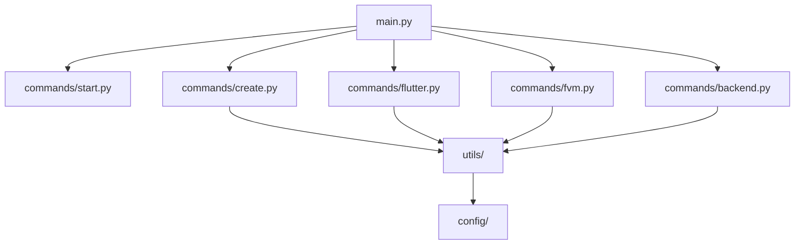

# FlutterCraft — Implementation Roadmap

---

## 🎯 Current Implementation Status

### ✅ Completed Components
- [x] Basic CLI structure with Typer
- [x] Entry point (main.py)
- [x] Basic `start` command implementation
- [x] Comprehensive documentation structure
- [x] Project setup (setup.py)
- [x] Welcome ASCII art display
- [x] Interactive command prompt

### ❌ Components for Future Implementation
- [ ] Core orchestration logic
- [ ] Utility modules expansion
- [ ] Configuration system
- [ ] Template engine
- [ ] Command implementations (create, flutter install, etc.)
- [ ] Test suite
- [ ] Error handling and validation

---

## 📋 Implementation Timeline

### 🚀 Phase 1: Foundation (Current)
**Priority: MEDIUM**

- [x] Create basic directory structure
- [x] Implement initial CLI with welcome art
- [x] Setup interactive command prompt
- [x] Create pip installation process
- [ ] Implement `utils/` modules (io, shell, validation)
- [ ] Implement `config/` system (defaults, paths)

**Effort Estimate**: 5-10 hours
**Dependencies**: None
**Deliverables**: Functional CLI entry point

### 🔧 Phase 2: Create Command
**Priority: HIGH**

- [ ] Implement Flutter detection
- [ ] Add `create` command implementation
- [ ] Add project scaffolding logic
- [ ] Add interactive prompts for project settings

**Effort Estimate**: 15-20 hours
**Dependencies**: Phase 1 completion
**Deliverables**: Functional create command

### 🏗️ Phase 3: Environment Management
**Priority: MEDIUM**

- [ ] Implement Flutter installation
- [ ] Add FVM support
- [ ] Add cross-platform compatibility

**Effort Estimate**: 10-15 hours
**Dependencies**: Phase 2 completion
**Deliverables**: Environment management commands

### 🎨 Phase 4: Integration Features
**Priority: LOW**

- [ ] Implement backend integration (Firebase, Supabase)
- [ ] Add GitHub repo creation
- [ ] Implement app icon generation

**Effort Estimate**: 15-20 hours
**Dependencies**: Phase 3 completion
**Deliverables**: Integration features

---

## 🔗 Module Dependencies

---

## 📊 Effort Distribution

| Phase | Component | Hours | Priority |
|-------|-----------|-------|----------|
| 1 | CLI Foundation | 5-10 | Medium |
| 2 | Create Command | 15-20 | High |
| 3 | Environment Management | 10-15 | Medium |
| 4 | Integration | 15-20 | Low |
| **Total** | **All Components** | **45-65** | **-** |

---

## 🎯 Success Metrics

### Phase 1 Success Criteria
- [x] CLI boots without errors
- [x] Welcome art displays correctly
- [x] Interactive prompt works
- [ ] Basic utility functions implemented

### Phase 2 Success Criteria
- [ ] `fluttercraft create` generates a basic Flutter project
- [ ] Interactive project setup prompts function correctly

### Phase 3 Success Criteria
- [ ] Flutter/FVM detection works on all platforms
- [ ] Flutter installation works cross-platform

### Phase 4 Success Criteria
- [ ] Backend integration works
- [ ] GitHub repository creation works
- [ ] Icon generation works

---

This roadmap provides a clear path from the current implementation to a fully-featured CLI tool. It will be updated as development progresses.
