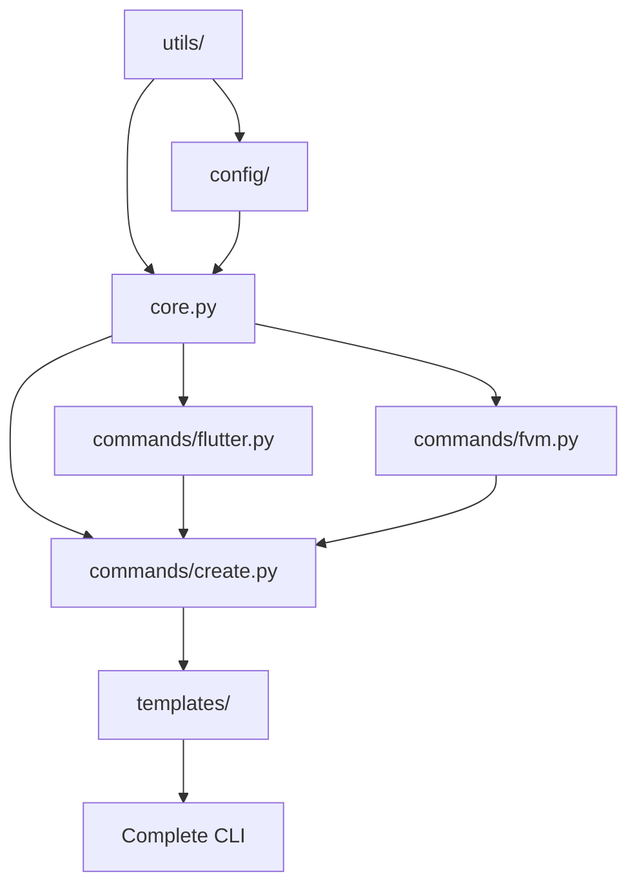

# FlutterCraft — Implementation Roadmap

---

## 🎯 Current Implementation Status

### ✅ Completed Components
- [x] Basic CLI structure with Typer
- [x] Entry point (`__main__.py`)
- [x] Basic `create` command shell
- [x] GitHub Actions CI workflow
- [x] Comprehensive documentation structure
- [x] Project configuration (`pyproject.toml`)

### ❌ Missing Critical Components
- [ ] Core orchestration logic (`core.py`)
- [ ] Utility modules (`utils/` directory)
- [ ] Configuration system (`config/` directory)
- [ ] Template engine (`templates/` directory)
- [ ] Complete command implementations
- [ ] Test suite (`tests/` directory)
- [ ] Error handling and validation

---

## 📋 8-Week Implementation Timeline

### 🚀 Phase 1: Foundation (Week 1-2)
**Priority: CRITICAL**

#### Week 1: Core Infrastructure
- [ ] Create missing directory structure
- [ ] Implement `utils/` modules (io, shell, validation, osinfo)
- [ ] Implement `config/` system (defaults, paths)
- [ ] Create `core.py` orchestration logic
- [ ] Fix command structure inconsistency

**Effort Estimate**: 20-25 hours
**Dependencies**: None
**Deliverables**: Complete project structure, basic utilities

#### Week 2: Template System & Testing Foundation
- [ ] Design and implement Jinja2 template system
- [ ] Create Flutter project templates
- [ ] Create GitHub workflow templates
- [ ] Set up comprehensive test structure
- [ ] Implement basic test cases

**Effort Estimate**: 15-20 hours
**Dependencies**: Week 1 completion
**Deliverables**: Template engine, test framework

### 🔧 Phase 2: Core Features (Week 3-4)

#### Week 3: Primary Command Implementation
- [ ] Complete `fluttercraft create` implementation
- [ ] Implement Flutter/FVM detection and installation
- [ ] Add interactive prompts with questionary
- [ ] Implement project scaffolding logic

**Effort Estimate**: 25-30 hours
**Dependencies**: Phase 1 completion
**Deliverables**: Functional create command

#### Week 4: Environment Management
- [ ] Implement `flutter.py` command module
- [ ] Implement `fvm.py` command module
- [ ] Add cross-platform compatibility
- [ ] Implement error handling and validation

**Effort Estimate**: 20-25 hours
**Dependencies**: Week 3 completion
**Deliverables**: Environment management commands

### 🏗️ Phase 3: Integration Features (Week 5-6)

#### Week 5: Backend Integration
- [ ] Implement `backend.py` command module
- [ ] Add Firebase integration logic
- [ ] Add Supabase integration logic
- [ ] Implement `github.py` command module

**Effort Estimate**: 25-30 hours
**Dependencies**: Phase 2 completion
**Deliverables**: Backend and GitHub integration

#### Week 6: Additional Commands
- [ ] Implement `logo.py` command module
- [ ] Implement `publish.py` command module
- [ ] Add documentation generation
- [ ] Implement configuration management

**Effort Estimate**: 20-25 hours
**Dependencies**: Week 5 completion
**Deliverables**: Complete command suite

### 🎨 Phase 4: Polish & Production (Week 7-8)

#### Week 7: Testing & Quality Assurance
- [ ] Achieve 80%+ test coverage
- [ ] Implement integration tests
- [ ] Add CLI testing with mocks
- [ ] Performance optimization and benchmarking

**Effort Estimate**: 20-25 hours
**Dependencies**: Phase 3 completion
**Deliverables**: Production-ready quality

#### Week 8: Documentation & Release Preparation
- [ ] Complete API documentation
- [ ] Add comprehensive examples
- [ ] Prepare PyPI release
- [ ] Final testing and bug fixes

**Effort Estimate**: 15-20 hours
**Dependencies**: Week 7 completion
**Deliverables**: Release-ready package

---

## 🔗 Module Dependencies

---

## 📊 Effort Distribution

| Phase | Component | Hours | Priority |
|-------|-----------|-------|----------|
| 1 | Infrastructure | 35-45 | Critical |
| 2 | Core Features | 45-55 | High |
| 3 | Integration | 45-55 | High |
| 4 | Polish | 35-45 | Medium |
| **Total** | **All Components** | **160-200** | **-** |

---

## 🎯 Success Metrics

### Phase 1 Success Criteria
- [ ] All documented modules exist with basic implementations
- [ ] CLI boots without errors
- [ ] Basic test suite runs successfully

### Phase 2 Success Criteria
- [ ] `fluttercraft create` generates a basic Flutter project
- [ ] Flutter/FVM detection works on all platforms
- [ ] Interactive prompts function correctly

### Phase 3 Success Criteria
- [ ] Complete project scaffolding with backend integration
- [ ] GitHub repository creation works
- [ ] All documented commands implemented

### Phase 4 Success Criteria
- [ ] 80%+ test coverage achieved
- [ ] Performance benchmarks met
- [ ] Ready for PyPI publication

---

## 🚨 Risk Mitigation

### High-Risk Items
1. **Cross-platform compatibility**: Test early and often on all platforms
2. **External tool dependencies**: Implement graceful fallbacks
3. **Template complexity**: Start simple, iterate based on feedback

### Contingency Plans
- If behind schedule: Reduce scope of Phase 3 features
- If external dependencies fail: Implement manual alternatives
- If testing coverage low: Extend Phase 4 timeline

---

This roadmap provides a clear path from the current minimal implementation to a production-ready CLI tool that matches the ambitious documentation.
